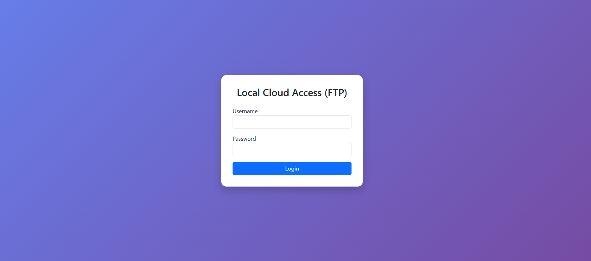

# ☁️ CloudBox - Personal Cloud Storage Manager

**CloudBox** is a robust, Flask-based web application, mobile friendly that mimics the functionality of modern cloud storage services like Google Drive or Dropbox. It allows users to upload, organize, view, and manage files on a local server with a professional interface.

Developed by **Karan and team**.

---

## 🚀 Features

* **📂 File Management:** Create folders, upload files, and organize data hierarchically.
* **🖱️ Drag & Drop Upload:** Modern drag-and-drop interface for bulk uploads.
* **🌙 Dark/Light Mode:** Toggle between themes with a persistent preference setting.
* **🔍 Real-time Search:** Instantly filter files and folders by name.
* **📊 Sorting & Grouping:** Sort by Name, Date, Size, or Type. Group files by their format (PDF, Images, etc.).
* **✏️ Rename & Delete:** Easily rename files or delete them in bulk.
* **👁️ File Preview:** Built-in preview for Images, PDFs, Text files, and Excel/CSV data.
* **🔒 Secure Login:** Simple session-based authentication system.

---

## 🛠️ Installation & Setup

1.  **Clone the Repository**
    ```bash
    git clone [https://github.com/your-username/CloudBox.git](https://github.com/your-username/CloudBox.git)
    cd CloudBox
    ```

2.  **Install Dependencies**
    Ensure you have Python installed. Then run:
    ```bash
    pip install -r requirements.txt
    ```

3.  **Run the Application**
    ```bash
    python app.py
    ```

4.  **Access the Dashboard (Localhost)**
    Open your browser and navigate to:
    `http://localhost:5000`

    * **Default Username:** `admin`
    * **Default Password:** `password123` *(Change this in app.py for security)*

---

## 🌐 How to Access on Local Network (LAN)

You can access CloudBox from any other device (Laptop, Mobile, Tablet) connected to the **same Wi-Fi/Network**.

1.  **Find your Host IP Address:**
    * **Windows:** Open Command Prompt (`cmd`) and type `ipconfig`. Look for **IPv4 Address** (e.g., `192.168.1.10` or `10.110.0.106`).
    * **Mac/Linux:** Open Terminal and type `ifconfig` or `ip a`.

2.  **Access on Other Device:**
    Open the browser on the other device and type:
    `http://<YOUR_IP_ADDRESS>:5000`
    
    *Example:* `http://192.168.1.10:5000`

**Note:** If the site doesn't load on other devices, ensure your firewall is allowing traffic on port 5000. You may need to temporarily turn off the firewall or create an inbound rule.

To open permanently : open CMD and run this command 
netsh advfirewall firewall add rule name="Flask 5000" dir=in action=allow protocol=TCP localport=5000

---

## 📸 Screenshots




---

## 🤝 Contributing

This project is maintained by **karan and team**. Contributions are welcome! Feel free to fork the repository and submit a pull request.

---

## 📄 License

This project is open-source and available for educational purposes.
